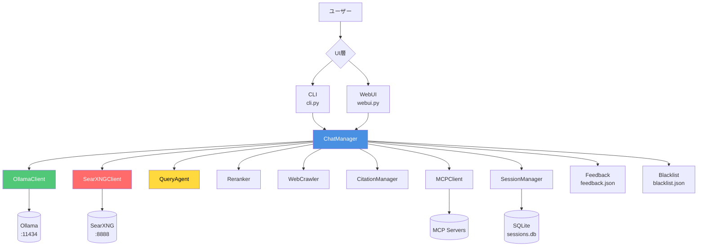
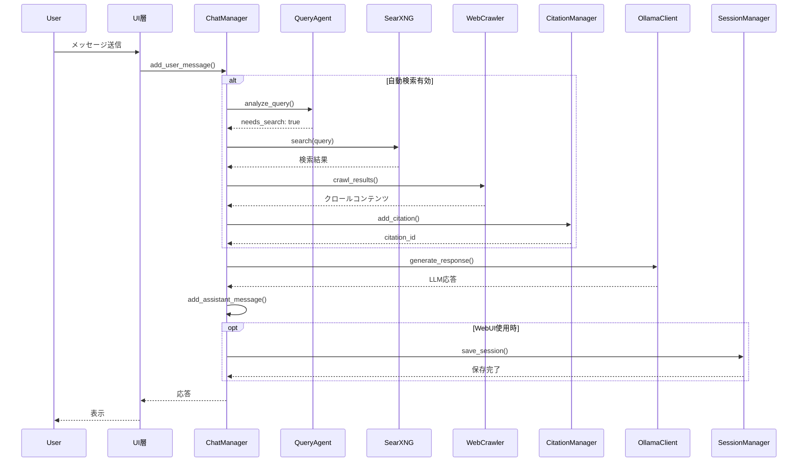
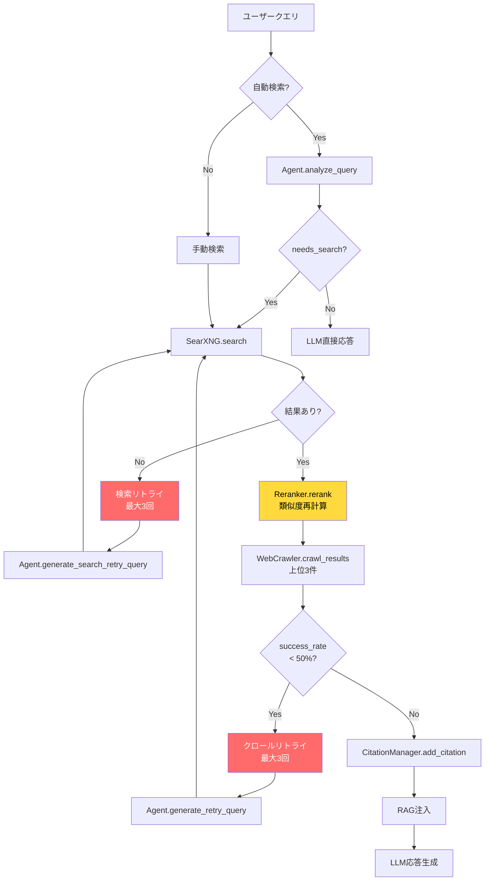
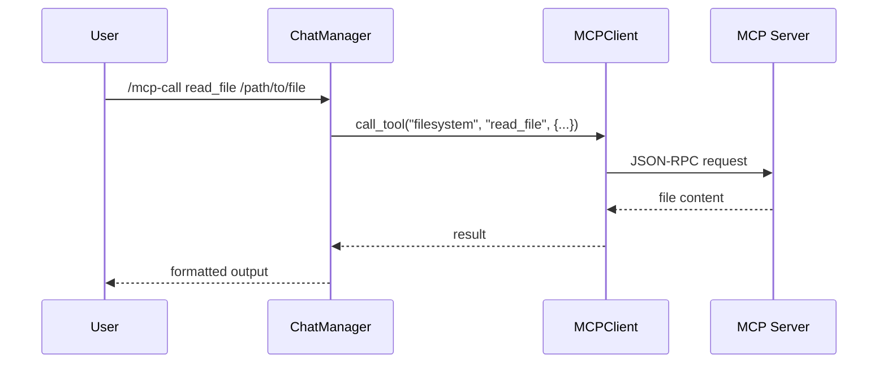

# 🏗️ Researcher アーキテクチャードキュメント

**バージョン**: 1.0  
**最終更新**: 2025年12月24日

---

## 📋 目次

1. [システム全体アーキテクチャー](#1-システム全体アーキテクチャー)
2. [コアコンポーネント](#2-コアコンポーネント)
3. [データストアアーキテクチャー](#3-データストアアーキテクチャー)
4. [検索・クロールアーキテクチャー](#4-検索クロールアーキテクチャー)
5. [LLMインテグレーション](#5-llmインテグレーション)
6. [エージェントシステム](#6-エージェントシステム)
7. [MCPインテグレーション](#7-mcpインテグレーション)
8. [リトライ・エラーハンドリング](#8-リトライエラーハンドリング)
9. [UI層アーキテクチャー](#9-ui層アーキテクチャー)
10. [デプロイメント](#10-デプロイメント)

---

## 1. システム全体アーキテクチャー

### 1.1 高レベルアーキテクチャー



### 1.2 データフロー



---

## 2. コアコンポーネント

### 2.1 コンポーネント一覧

| コンポーネント | ファイル | 責務 | 依存関係 |
|--------------|---------|------|---------|
| **ChatManager** | `chat_manager.py` | 会話管理、検索統合、RAG | すべてのコンポーネント |
| **OllamaClient** | `ollama_client.py` | LLM API通信 | Ollama Server |
| **SearXNGClient** | `searxng_client.py` | Web検索API | SearXNG Server |
| **QueryAgent** | `agent.py` | 検索必要性判定、クエリ生成 | OllamaClient |
| **WebCrawler** | `web_crawler.py` | Webページクロール | - |
| **CitationManager** | `citation_manager.py` | 引用管理、信頼性スコア | - |
| **Reranker** | `reranker.py` | 検索結果の再ランク | OllamaClient |
| **SessionManager** | `session_manager.py` | セッション永続化 | SQLite |
| **MCPClient** | `mcp_client.py` | MCPサーバー通信 | MCP Servers |

### 2.2 ChatManager（中心コンポーネント）

```python
class ChatManager:
    """
    会話の中心的な管理クラス
    - メッセージ履歴管理
    - 検索・クロール・RAG統合
    - 自己評価・フィードバック調整
    - 引用生成
    """
    
    # 主要メソッド
    - add_user_message()           # ユーザーメッセージ追加
    - get_response()               # LLM応答生成
    - search()                     # Web検索実行
    - auto_search()                # 自動検索判定＋実行
    - self_evaluate()              # 応答品質評価
    - clear_history()              # 履歴クリア
```

**状態管理**:
```python
self.messages: List[Dict]              # メッセージ履歴
self.current_citation_ids: List[int]   # 現在の引用ID
self.last_search_content: str          # 最後のクロールコンテンツ
self.last_search_turns_remaining: int  # RAG注入残ターン数
self.last_evaluation_score: Dict       # 最後の評価スコア
```

---

## 3. データストアアーキテクチャー

### 3.1 データ保存場所

すべてのデータは `~/.researcher/` ディレクトリに集約:

```
~/.researcher/
├── sessions.db          # セッション管理（SQLite）
├── feedback.json        # フィードバック記録（JSON）
├── blacklist.json       # ドメインブラックリスト（JSON）
└── production.yaml      # 本番環境設定（YAML）
```

### 3.2 セッション管理（SQLite）

**ファイル**: `~/.researcher/sessions.db`  
**管理クラス**: `SessionManager`

#### スキーマ
```sql
CREATE TABLE sessions (
    id INTEGER PRIMARY KEY AUTOINCREMENT,
    name TEXT NOT NULL,                    -- セッション名
    history TEXT NOT NULL,                 -- チャット履歴（JSON）
    model TEXT NOT NULL,                   -- 使用モデル
    language TEXT NOT NULL,                -- 言語設定（ja/en）
    last_evaluation_score TEXT,            -- 最終評価スコア（JSON）
    created_at TIMESTAMP DEFAULT CURRENT_TIMESTAMP,
    updated_at TIMESTAMP DEFAULT CURRENT_TIMESTAMP
)
```

#### データ構造
```json
{
  "id": 1,
  "name": "セッション名",
  "history": [
    {"role": "user", "content": "質問"},
    {"role": "assistant", "content": "回答"}
  ],
  "model": "gpt-oss:20b",
  "language": "ja",
  "last_evaluation_score": {"overall": 0.85, "relevance": 0.9},
  "created_at": "2025-12-24T16:00:00",
  "updated_at": "2025-12-24T16:30:00"
}
```

#### API
```python
create_session(name, model, language) -> int
save_session(id, history, model, language, eval_score) -> bool
load_session(id) -> Dict
list_sessions() -> List[Dict]
delete_session(id) -> bool
search_sessions(query) -> List[Dict]
rename_session(id, new_name) -> bool
```

### 3.3 フィードバック管理（JSON）

**ファイル**: `~/.researcher/feedback.json`  
**管理関数**: `save_feedback()`, `load_feedback_history()`, `get_feedback_stats()`

#### データ構造
```json
[
  {
    "timestamp": "2025-12-24T16:30:45",
    "query": "最新のPython 3.13の機能は？",
    "response": "Python 3.13には...の機能が追加されました",
    "rating": "up",              // "up" または "down"
    "model": "gpt-oss:20b",
    "session_id": 1
  }
]
```

#### 特徴
- ✅ **アトミック書き込み**: `tempfile` + `os.replace()` で競合回避
- ✅ **リトライ機構**: 最大3回のリトライ（Exponential Backoff）
- ✅ **タイムスタンプ降順ソート**: 最新フィードバックを優先
- ✅ **モデル別統計**: thumbs_down率の自動警告（30%超過時）

### 3.4 引用管理（メモリ内）

**管理クラス**: `CitationManager`

#### データ構造
```python
{
  1: {
    "id": 1,
    "url": "https://example.com/article",
    "title": "記事タイトル",
    "snippet": "記事の抜粋...",
    "date": "2025-12-24T00:00:00",
    "relevance_score": 0.85,
    "credibility_score": 0.75  # 自動計算
  }
}
```

#### 信頼性スコア計算
```python
credibility_score = (domain_score * 0.4) + (freshness_score * 0.3) + (relevance * 0.3)
```

**domain_score**:
- `.edu`, `.gov`: 1.0
- `wikipedia.org`, `arxiv.org`: 0.9
- 主要ニュース（NYT, BBC, Reuters, AP）: 0.8
- その他: 0.5

**freshness_score**:
- 1日以内: 1.0
- 30日以内: 0.8
- 365日以内: 0.6
- それ以降: 0.4

### 3.5 データ永続化戦略

| データ種別 | 保存場所 | 永続化 | トランザクション | バックアップ |
|-----------|---------|--------|----------------|------------|
| セッション | SQLite | ✅ 自動 | ✅ ACID | `cp sessions.db sessions.db.backup` |
| フィードバック | JSON | ✅ 手動 | ✅ アトミック | `cp feedback.json feedback.json.backup` |
| ブラックリスト | JSON | ✅ 手動 | ❌ | `cp blacklist.json blacklist.json.backup` |
| 引用 | メモリ | ❌ | - | - |
| チャット履歴 | メモリ | ⚠️ 条件付き* | - | - |

*WebUIではSessionManagerに保存されるが、CLIではメモリのみ

---

## 4. 検索・クロールアーキテクチャー

### 4.1 検索フロー



### 4.2 検索リトライロジック

**トリガー**: `searxng_client.search()` が `RuntimeError` または空結果を返す

**戦略**:
1. **1回目**: クエリの簡潔化（複雑な演算子削除）
2. **2回目**: キーワードの一般化（製品名→一般概念）
3. **3回目**: 最小限のキーワード（1-2個）

**失敗理由の自動分類**:
```python
def _extract_failure_reason(error_message: str) -> str:
    if "timeout" in error_lower:
        return "timeout"
    elif "connection" in error_lower:
        return "connection_error"
    elif "http" in error_lower or "403" in error:
        return "http_error"
    elif "parse" in error_lower or "html" in error_lower:
        return "parse_error"
    elif "empty" in error_lower:
        return "empty_results"
    else:
        return "unknown"
```

### 4.3 クロールリトライロジック

**トリガー**: `success_rate < 0.5`（50%未満の成功率）

**戦略**:
- `Agent.generate_retry_query()` で失敗ドメインを避けた代替クエリ生成
- 最大3回リトライ
- URL重複除外＋統合

**プログレスコールバック**:
```python
# 検索・クロール進行状況をUI層に通知
progress_callback("retry_start", {
    "retry_count": 1,
    "max_retries": 3,
    "query": current_query,
    "error": str(exc)
})

progress_callback("query_generated", {
    "retry_count": 1,
    "new_query": alternative_query,
    "failure_reason": "timeout"
})

progress_callback("all_retries_failed", {
    "query": original_query,
    "max_retries": 3
})
```

### 4.4 WebCrawler統合

**クロール対象**: 上位3件の検索結果

**抽出処理**:
1. HTMLフェッチ（タイムアウト: 10秒）
2. BeautifulSoupでパース
3. `<script>`, `<style>`, `<nav>` タグ除外
4. テキスト抽出＋正規化
5. ブラックリストドメインスキップ

**RAG注入**:
```python
if self.last_search_content and self.last_search_turns_remaining > 0:
    rag_prompt = self._get_rag_system_prompt()
    crawl_system_msg = {
        "role": "system",
        "content": rag_prompt + self.last_search_content
    }
    messages.insert(system_count, crawl_system_msg)
```

---

## 5. LLMインテグレーション

### 5.1 Ollamaクライアント

**接続先**: `http://localhost:11434`

**API**:
```python
generate_response(messages, model=None, stream=False) -> str
get_embeddings(text, model="nomic-embed-text-v2-moe") -> List[float]
test_connection() -> bool
```

### 5.2 プロンプト戦略

#### システムプロンプト構造
```
┌─────────────────────────────────────┐
│ ベースプロンプト                     │
│ "You are a helpful assistant."      │
└─────────────────┬───────────────────┘
                  │
      ┌───────────┴───────────┐
      │                       │
      ▼                       ▼
┌───────────────┐    ┌─────────────────┐
│ RAGプロンプト  │    │ 検索失敗プロンプト│
│（Web検索時）   │    │（全リトライ失敗時）│
└───────────────┘    └─────────────────┘
      │
      ▼
┌───────────────────────────────────────┐
│ フィードバック調整プロンプト          │
│（thumbs_down率 > 30%時に警告追加）    │
└───────────────────────────────────────┘
```

#### RAGプロンプト（日本語）
```
以下は、検索エンジンとWebクローリングから取得した最新情報です。
これらの情報を優先し、あなたの訓練データに基づく回答は避けてください。
検索結果の引用には [1], [2] の形式を使用してください。

[クロールコンテンツ]
```

#### 検索失敗プロンプト
```
検索に失敗したため最新情報を提供できません。
訓練データに基づく回答を避け、検索失敗をユーザーに伝えてください。
```

### 5.3 自己評価システム

**評価モデル**: デフォルトは通常モデルと同じ（`--evaluation-model`で変更可能）

**評価基準**:
```python
{
  "relevance": 0.0-1.0,      # 質問との関連性
  "accuracy": 0.0-1.0,       # 情報の正確性
  "completeness": 0.0-1.0,   # 回答の完全性
  "clarity": 0.0-1.0,        # 説明の明瞭性
  "overall_score": 0.0-1.0   # 総合スコア（4項目の平均）
}
```

**リトライ戦略**:
- `overall_score < threshold`（デフォルト: 0.7）の場合
- 自動検索を再実行して応答を再生成
- 最大1回のリトライ（無限ループ防止）

---

## 6. エージェントシステム

### 6.1 QueryAgent

**役割**: クエリ分析＋代替クエリ生成

#### 検索必要性判定
```python
analyze_query(query: str) -> Dict[str, Any]
```

**判定基準**:
- 最新ニュース・時事問題
- 統計データ・数値情報
- 現在のイベント・スケジュール
- 不明な事実・確認が必要な情報
- 企業製品の最新版・機能・リリースノート

**出力**:
```json
{
  "needs_search": true,
  "keywords": ["Python", "3.13", "新機能"],
  "reasoning": "最新バージョン情報のため検索が必要"
}
```

#### 代替クエリ生成（クロール失敗時）
```python
generate_retry_query(
    original_query: str,
    failed_domains: Set[str],
    previous_keywords: List[str]
) -> str
```

**戦略**:
- 失敗ドメインを避ける
- 公式ドキュメント・製品サイト優先の検索語を提案

#### 代替クエリ生成（検索失敗時）
```python
generate_search_retry_query(
    original_query: str,
    failure_reason: str,
    retry_count: int
) -> str
```

**段階的戦略**:
1. クエリの簡潔化
2. キーワードの一般化
3. 最小限のキーワード

---

## 7. MCPインテグレーション

### 7.1 MCPクライアント

**プロトコル**: Model Context Protocol

**サポートツール**:
- `filesystem`: ファイルシステムアクセス
- `notes`: Apple Notesアクセス
- その他カスタムMCPサーバー

### 7.2 設定方法

**設定ファイル**: `mcp_config.json` または `mcp_config.toml`

```json
{
  "mcpServers": {
    "filesystem": {
      "command": "node",
      "args": ["/path/to/server-filesystem/build/index.js", "/Users/username"],
      "enabled": true
    },
    "notes": {
      "command": "node",
      "args": ["/path/to/mcp-apple-notes/build/index.js"],
      "enabled": false
    }
  }
}
```

### 7.3 ツール呼び出しフロー



---

## 8. リトライ・エラーハンドリング

### 8.1 リトライ階層

```
レベル1: 検索リトライ（SearchManager）
├─ RuntimeError、空結果時
├─ 最大3回
└─ Agent.generate_search_retry_query()

レベル2: クロールリトライ（WebCrawler）
├─ success_rate < 50%時
├─ 最大3回
└─ Agent.generate_retry_query()

レベル3: 自己評価リトライ（ChatManager）
├─ overall_score < threshold時
├─ 最大1回
└─ 自動検索再実行
```

### 8.2 エラーハンドリング戦略

| エラー種別 | 処理 | リトライ | UI通知 |
|-----------|------|---------|--------|
| **検索エンジンタイムアウト** | リトライ | ✅ 3回 | プログレスコールバック |
| **検索エンジン接続エラー** | リトライ | ✅ 3回 | プログレスコールバック |
| **検索結果空** | リトライ | ✅ 3回 | プログレスコールバック |
| **クロール失敗** | リトライ | ✅ 3回 | ログのみ |
| **LLM生成エラー** | スキップ | ❌ | エラーメッセージ |
| **Rerankerエラー** | フォールバック | ❌ | サイレント |
| **評価スコア低下** | 自動検索 | ✅ 1回 | ログのみ |

### 8.3 プログレスコールバックイベント

| イベント名 | タイミング | データ |
|-----------|----------|--------|
| `retry_start` | 検索失敗時、リトライ開始前 | `{retry_count, max_retries, query, error}` |
| `query_generated` | 代替クエリ生成後 | `{retry_count, new_query, failure_reason}` |
| `retry_attempt` | リトライ試行直前 | `{retry_count, query}` |
| `all_retries_failed` | すべてのリトライが失敗 | `{query, max_retries}` |

---

## 9. UI層アーキテクチャー

### 9.1 CLI（cli.py）

**起動**: `python -m researcher.cli`

**アーキテクチャー**:
```
┌────────────────────────────────────┐
│         CLIエントリーポイント       │
└────────────┬───────────────────────┘
             │
    ┌────────┴────────┐
    │                 │
    ▼                 ▼
┌─────────┐    ┌─────────────┐
│ サービス │    │ コンポーネント│
│ 起動確認 │    │ 初期化       │
└─────────┘    └─────────────┘
    │                 │
    │   ┌─────────────┴─────────────┐
    │   │                           │
    ▼   ▼                           ▼
┌─────────────┐              ┌──────────────┐
│ ChatManager │              │SessionManager│
│ 作成        │              │ 作成         │
└─────────────┘              └──────────────┘
         │                          │
         └────────┬─────────────────┘
                  │
                  ▼
         ┌────────────────┐
         │  REPLループ    │
         │  - /commands   │
         │  - 会話処理    │
         └────────────────┘
```

**コマンド**:
- `/exit`: 終了
- `/clear`: 履歴クリア
- `/history`: 履歴表示
- `/search <query>`: 手動検索
- `/blacklist [show|add|clear]`: ブラックリスト管理
- `/status`: 接続確認
- `/mcp-call <tool> <args>`: MCPツール呼び出し
- `/feedback [up|down|stats]`: フィードバック管理

### 9.2 WebUI（webui.py）

**起動**: `python -m researcher.webui` または `streamlit run src/researcher/webui.py`

**アーキテクチャー**:
```
┌──────────────────────────────────────┐
│       Streamlit初期化                │
└──────────────┬───────────────────────┘
               │
    ┌──────────┴──────────┐
    │                     │
    ▼                     ▼
┌─────────────┐    ┌──────────────┐
│ サイドバー   │    │  メインチャット│
│ - 設定       │    │  - メッセージ  │
│ - セッション │    │  - 検索結果   │
│ - 引用       │    │  - フィードバック│
└─────────────┘    └──────────────┘
```

**セッション状態**:
```python
st.session_state = {
    "initialized": bool,
    "chat_manager": ChatManager,
    "session_manager": SessionManager,
    "current_session_id": int,
    "messages": List[Dict],
    "model": str,
    "language": str,
    "auto_search": bool
}
```

**自動保存**:
- メッセージ送信後に自動的に `SessionManager.save_session()` 呼び出し
- 評価スコアも含めて保存

---

## 10. デプロイメント

### 10.1 ディレクトリ構造

```
researcher/
├── src/researcher/         # ソースコード
│   ├── __init__.py
│   ├── chat_manager.py
│   ├── ollama_client.py
│   ├── searxng_client.py
│   ├── agent.py
│   ├── web_crawler.py
│   ├── citation_manager.py
│   ├── reranker.py
│   ├── session_manager.py
│   ├── mcp_client.py
│   ├── config.py
│   ├── cli.py
│   ├── webui.py
│   └── webui_launcher.py
├── tests/                  # テストコード
├── docs/                   # ドキュメント
├── pyproject.toml          # パッケージ設定
├── run.sh                  # 統合起動スクリプト
├── setup.sh                # 環境セットアップ
├── deploy.sh               # デプロイスクリプト
└── ~/.researcher/          # データディレクトリ
    ├── sessions.db
    ├── feedback.json
    ├── blacklist.json
    └── production.yaml
```

### 10.2 デプロイスクリプト

**使用法**:
```bash
./deploy.sh [OPTIONS]

OPTIONS:
  --init      設定ファイルも含めて初回デプロイ
  --restart   デプロイ後にWebUIプロセスを自動再起動
  -h, --help  ヘルプメッセージ
```

**デプロイフロー**:
1. `~/.researcher/production.yaml` からデプロイ先読み取り
2. `src/` ディレクトリをコピー
3. `pyproject.toml`、`setup.sh`、`run.sh` をコピー
4. `--init` 時: 設定ファイルもコピー
5. `--restart` 時: WebUIプロセスを自動再起動

### 10.3 本番環境設定

**production.yaml**:
```yaml
path: /Users/furuta/production/researcher
```

**環境変数**:
```bash
# Ollama設定
OLLAMA_HOST=http://localhost:11434

# SearXNG設定
SEARXNG_URL=http://localhost:8888

# デフォルトモデル
DEFAULT_MODEL=gpt-oss:20b

# Embedding モデル
EMBEDDING_MODEL=nomic-embed-text-v2-moe

# リトライ設定
MAX_SEARCH_RETRIES=3
MAX_CRAWL_RETRIES=3

# MCP設定
MCP_SERVERS_CONFIG=/path/to/mcp_config.json
```

---

## 🔗 関連ドキュメント

- [セキュリティと設定ガイド](security.md)
- [Streamlit WebUIガイド](streamlit-guide.md)
- [MCPセットアップガイド](mcp-setup.md)
- [README](../README.md)

---

**最終更新**: 2025年12月24日  
**メンテナー**: researcher開発チーム
